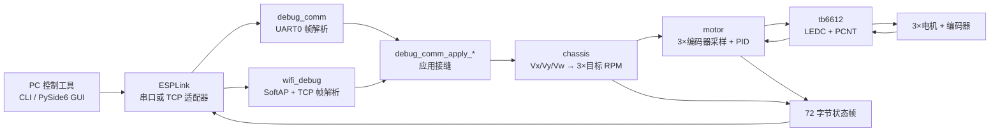

# Blink 三轮底盘项目导览

> 最后核对：2026-07-24  
> 适合读者：第一次接触本仓库、准备调试底盘或继续开发控制功能的开发者

## 1. 这个项目是什么

这个仓库源自 ESP-IDF 的 Blink 示例，但当前主体已经变成一套 **ESP32-S3 三轮全向底盘控制原型**。固件负责：

- 驱动 3 路 TB6612 直流电机；
- 用 PCNT 读取 3 路正交编码器；
- 把底盘速度换算成 3 个轮子的目标 RPM；
- 用 3 路 PID 计算 PWM；
- 预留 UART 和 Wi-Fi/TCP 两种远程调试通道；
- 由 Python CLI/GUI 发送速度、PID 和急停命令并显示状态。

项目目前处于“功能模块大多已经存在，但运行入口仍是台架测试模式”的阶段。根目录 `README.md` 中的 Blink/WS2812 描述只反映了项目来源，不能代表当前固件的实际主流程。

## 2. 技术栈

| 层次 | 技术 | 仓库中的依据 |
|---|---|---|
| MCU / 目标板 | ESP32-S3 | `dependencies.lock`、`sdkconfig`、VS Code 配置 |
| 固件 | C + ESP-IDF 6.0.2 | `CMakeLists.txt`、`dependencies.lock` |
| 实时调度 | FreeRTOS tasks | `main/blink_example_main.c` |
| 电机 PWM | ESP-IDF LEDC | `components/tb6612/` |
| 编码器 | ESP-IDF PCNT | `components/tb6612/` |
| 有线调试 | UART0，115200 | `components/debug_comm/` |
| 无线调试 | SoftAP/APSTA + TCP，默认 8888 | `components/wifi_debug/` |
| PC 工具 | Python、pyserial、PySide6、pyqtgraph | `tools/` |
| 构建 | ESP-IDF CMake + Ninja | 根目录及各模块的 `CMakeLists.txt` |
| 测试 | pytest-embedded（目前仅检查固件产物大小） | `pytest_blink.py` |

## 3. 当前实际运行状态

理解本项目最重要的一点，是区分“已有能力”和“当前入口真正启用的能力”。

`app_main()` 当前会：

1. 初始化 3 个 TB6612/编码器实例；
2. 初始化 3 路 PID；
3. 初始化底盘全局状态；
4. 启动 10 ms 周期的电机闭环任务；
5. 启动 100 ms 周期的底盘换算任务。

但当前还有以下测试态行为：

- `chassis_task` 每 100 ms 直接写入 `ROBOT_CHASSI.Vx = 100`；
- UART 调试初始化 `debug_comm_init()` 被注释；
- Wi-Fi 调试初始化 `wifi_debug_start()` 被注释；
- 10 Hz 状态上报任务被注释；
- `rgb_led.c` 没有注册到 `main/CMakeLists.txt`，也没有被入口调用。

因此，**按当前源码烧录后，PC 端 GUI/CLI 不能控制底盘**。即使恢复了通信初始化，硬编码的 `Vx = 100` 也会在最多 100 ms 后覆盖远程速度或急停状态。

## 4. 高层架构



虚线含义没有画入图中：UART、Wi-Fi 和状态上报模块虽然已编译进依赖图，但当前在 `app_main()` 中没有启动。

## 5. 目录地图

```text
blink/
├── main/
│   ├── blink_example_main.c    # 固件入口、FreeRTOS 任务、通信 hook
│   ├── rgb_led.c/.h            # 未接入当前构建的 WS2812 封装
│   ├── Kconfig.projbuild       # LED、电机、编码器、Wi-Fi 菜单配置
│   └── idf_component.yml       # led_strip 外部依赖
├── components/
│   ├── chassis/                # 三轮运动学与底盘速度状态
│   ├── config/                 # 3 路 PID 默认参数
│   ├── debug_comm/             # UART 二进制协议
│   ├── motor/                  # 三个电机实例、测速和 PID 闭环
│   ├── pid/                    # 位置式/增量式 PID 算法
│   ├── tb6612/                 # 可复用 TB6612 + 编码器驱动
│   └── wifi_debug/             # SoftAP/APSTA + TCP 调试
├── tools/
│   ├── esp_link.py             # GUI 共用的串口/TCP 客户端
│   ├── debug_panel.py          # 串口命令行控制器
│   ├── debug_panel_gui.py      # 串口/TCP GUI、曲线和 PID 调参
│   └── README.md               # PC 工具说明
├── managed_components/         # ESP-IDF 管理的 led_strip，通常不要手改
├── pytest_blink.py             # 当前唯一自动化测试
├── sdkconfig*                  # 芯片和 menuconfig 结果/默认值
└── build/                      # 已生成产物；本副本缓存仍指向旧绝对路径
```

## 6. 关键入口和接口

| 想理解的内容 | 首先阅读 | 主要接口 |
|---|---|---|
| 程序怎样启动 | `main/blink_example_main.c` | `app_main()` |
| 底盘速度怎样变成轮速 | `components/chassis/chassis.c` | `chassis_set_velocity()`、`Robot_Wheels_RPM_calculate()` |
| 轮速怎样闭环 | `components/motor/motor.c` | `set_motor_speed()` |
| PID 的具体公式 | `components/pid/pid.c` | `pid_calc()` |
| PWM、方向和编码器 | `components/tb6612/tb6612.c` | `tb6612_*()` |
| 串口协议 | `components/debug_comm/include/debug_comm.h` | `debug_comm_init()` |
| Wi-Fi 调试 | `components/wifi_debug/wifi_debug.c` | `wifi_debug_start()` |
| PC 端统一连接层 | `tools/esp_link.py` | `ESPLink` |
| GUI 交互 | `tools/debug_panel_gui.py` | `MainWindow` |

推荐阅读顺序：

1. `main/blink_example_main.c`
2. `components/chassis/chassis.c`
3. `components/motor/motor.c`
4. `components/tb6612/include/tb6612.h`
5. `components/tb6612/tb6612.c`
6. `components/pid/pid.c`
7. `components/debug_comm/include/debug_comm.h`
8. `tools/esp_link.py`
9. 需要无线或 GUI 时再读 `wifi_debug.c`、`debug_panel_gui.py`

## 7. 三条核心数据流

### 7.1 当前固件实际执行的控制流

```text
chassis_task（100 ms）
  → 强制 Vx = 100
  → Robot_Wheels_RPM_calculate()
  → 写入 chassisMotorRealInfo[0..2].TARGET_RPM

motor_task（10 ms）
  → tb6612_read_speed() 读取并清空 PCNT
  → counts/s 换算成 RPM
  → pid_calc(target RPM, real RPM)
  → PID 输出转换为 [-1000, 1000] 的 PWM 千分比
  → tb6612_set_speed()
```

### 7.2 设计中的远程控制流

```text
GUI/CLI
  → CMD_SET_VELOCITY
  → UART 或 TCP 解析器
  → debug_comm_apply_velocity()
  → chassis_set_velocity() 限幅并保存 Vx/Vy/Vw
  → Robot_Wheels_RPM_calculate()
  → 3 路电机闭环
```

这条流目前被两个条件阻断：通信初始化被注释，且 `chassis_task` 会覆盖速度。

### 7.3 状态回传流

`debug_comm_send_state()` 或 Wi-Fi 的 `send_state_to()` 会打包 72 字节：

| 偏移 | 内容 | 大小 |
|---|---|---|
| 0 | 3×目标 RPM | 12 B |
| 12 | 3×实测 RPM | 12 B |
| 24 | 3 组 kp/ki/kd | 36 B |
| 60 | Vx/Vy/Vw | 12 B |

PC 端 `ESPLink._parse_state()` 按同样偏移解析并更新 GUI。

## 8. 通信协议

所有数值采用小端格式：

```text
[0xAA] [CMD] [LEN] [PAYLOAD...] [CHK]
CHK = (0xAA + CMD + LEN + sum(payload)) & 0xFF
```

| CMD | 方向 | 含义 | Payload |
|---|---|---|---|
| `0x01` | PC → ESP | 设置底盘速度 | 3×float：Vx, Vy, Vw |
| `0x02` | PC → ESP | 设置单路 PID | u8 index + 3×float |
| `0x03` | PC → ESP | 设置速度上限 | 3×float |
| `0x04` | PC → ESP | 急停 | 空 |
| `0x05` | PC → ESP | Ping/请求状态 | 空 |
| `0x10` | ESP → PC | 状态上报 | 72 B |

## 9. 硬件映射

当前真正生效的引脚来自 `components/motor/motor.c` 中的硬编码实例，而不是 Kconfig：

| 电机 | IN1 | IN2 | PWM | 编码器 A | 编码器 B | LEDC 通道 | 编码器反向 |
|---|---:|---:|---:|---:|---:|---:|---|
| 1 | 16 | 17 | 18 | 41 | 42 | 0 | 是 |
| 2 | 4 | 5 | 6 | 7 | 15 | 1 | 否 |
| 3 | 8 | 9 | 10 | 11 | 12 | 2 | 是 |

共同参数：

- PWM：20 kHz、10 bit、LEDC low-speed timer 0；
- 编码器：1320 个四倍频计数/输出轴转；
- TB6612 `STBY` 假定由硬件直接拉到 3.3 V；
- 电机电源、编码器、ESP32 和 TB6612 必须共地。

## 10. 模块设计判断

这里使用“模块、接口、实现、接缝、适配器、深度”来描述设计。

### `tb6612`：当前最深的模块

它的接口只有初始化、设速、滑行、刹车、测速、释放，却隐藏了 GPIO 校验、LEDC 配置、换向保护、PCNT 正交解码、采样时间和清理逻辑。调用者获得的杠杆高，硬件细节具有较好的局部性。

### `pid`：算法模块，接口较小

位置式和增量式 PID 都藏在同一实现中，调用者主要使用初始化和计算接口。需要注意的是 `PID_T` 完整暴露，通信和 GUI 状态上报直接读取 `kp/ki/kd`，所以其内部状态还不完全私有。

### `chassis`：有清晰意图，但接口和全局状态混合

速度设置、限幅和轮速换算形成了自然接缝；但 `ROBOT_CHASSI`、`chassisMotorRealInfo` 都由外部直接访问，调用者需要知道较多实现细节。单位换算宏当前都是 `1.0f`，运动学公式还不能单凭接口判断物理单位是否正确。

### `motor`：当前偏浅

它既拥有三个硬编码电机适配器，又拥有三路 PID 和共享状态；`set_motor_speed()` 只是把测速、PID 和驱动串起来。删除该模块后复杂度只会移动少量代码，因此后续可以把“三路电机控制器”深化成一个小接口，把实例配置、采样周期和错误策略隐藏进去。

### 通信：接缝已经出现，但协议实现重复

`debug_comm_apply_*()` 的 weak/strong hook 是一个有价值的应用接缝，UART 和 TCP 是两个真实适配器。但帧编解码分别出现在：

- `components/debug_comm/debug_comm.c`
- `components/wifi_debug/wifi_debug.c`
- `tools/esp_link.py`
- `tools/debug_panel.py`

固件侧尤其适合提取一个传输无关的协议模块，让 UART/TCP 只负责读写字节。PC CLI 也可以直接复用 `ESPLink`，避免协议变更时多处同步。

## 11. 配置与约定

- C 模块采用 ESP-IDF component 结构：`include/*.h` + `*.c` + `CMakeLists.txt`。
- C 函数和文件主要使用 `snake_case`，类型主要使用大写或 `_t` 后缀。
- Python 使用 `snake_case`，GUI 类使用 `PascalCase`。
- 错误处理以 `esp_err_t` 为主；入口和电机闭环大量使用 `ESP_ERROR_CHECK`，错误会使固件终止。
- 状态主要保存在全局对象中，没有互斥锁或消息队列。
- Git 历史只有一次 `first commit`，无法可靠推断提交和分支约定。
- 部分 C 文件中的中文注释已经发生乱码，修改这些文件时应保持 UTF-8，并逐步修复受影响注释。

## 12. 常见开发任务

### 构建与烧录

```powershell
idf.py set-target esp32s3
idf.py -B build-local build
idf.py -B build-local -p COM3 flash monitor
```

使用单独的 `build-local` 是因为仓库现有 `build/` 的 CMake 缓存仍指向旧机器路径。

### 启动 PC 工具

```powershell
python -m pip install pyserial pyside6 pyqtgraph
python tools/debug_panel_gui.py
python tools/debug_panel.py --port COM3
```

GUI 依赖 `pyqtgraph`，现有 `tools/README.md` 的安装命令没有列出它。

### 修改 PID 默认值

编辑 `components/config/config.c`。运行时调参由命令 `0x02` 进入 `pid_reset()`。

### 修改电机引脚或编码器方向

编辑 `components/motor/motor.c` 中的 `s_motor1`、`s_motor2`、`s_motor3`。当前 `menuconfig` 中的电机引脚只覆盖示例配置，并未驱动这三个实例。

### 修改底盘运动学

编辑 `components/chassis/chassis.c` 的 `Robot_Wheels_RPM_calculate()`，同时先确认：

- Vx/Vy 的单位；
- Vw 的单位；
- 轮半径和底盘半径；
- 输出应是电机轴 RPM 还是轮轴 RPM；
- 减速比是否已包含在 1320 CPR 或换算系数中。

### 增加新的调试命令

需要同步更新固件枚举、固件解析器和 PC 客户端。更稳妥的顺序是先抽取共享协议模块，再新增命令。

## 13. 已确认的风险和不一致

按优先级排序：

1. **远程急停不是持久状态**：`chassis_stop()` 清零后，`chassis_task` 会重新写入 `Vx = 100`。
2. **远程调试当前未启用**：UART、Wi-Fi 和状态上报任务都被注释。
3. **配置来源分裂**：Kconfig/defaults 与 `motor.c` 的三路硬编码参数不一致。
4. **共享状态无同步**：通信任务、底盘任务和电机任务可同时读写全局 float/PID 状态。
5. **UART0 同时承载日志和二进制帧**：日志可能与状态帧交错，协议层需要更强的串行化或独立 UART。
6. **控制单位尚未闭合**：运动学换算系数是占位值 `1.0f`，当前 `Vx = 100` 也超过声明的默认上限 1.0。
7. **文档和构建不一致**：根 README 仍以 Blink/单电机示例为主，`rgb_led.c` 未参与构建。
8. **测试覆盖不足**：现有 pytest 只读取 `blink.bin` 大小，没有验证运动学、PID、协议或急停。
9. **绝对路径陈旧**：`.vscode/settings.json` 和 GUI 帮助文本包含上一位开发者的本地路径。

## 14. 建议的下一步

如果目标是尽快让小车安全地接受远程控制，建议按这个顺序推进：

1. 移除 `chassis_task` 中硬编码的 `Vx = 100`，把急停设计成需要显式解除的状态；
2. 选择并启用一种调试传输，先做 UART，再启用 10 Hz 状态上报；
3. 用单一配置表生成三个电机实例，消除 Kconfig 与源码分裂；
4. 明确运动学单位、减速比和轮径，补纯函数测试；
5. 抽取固件侧共享帧编解码，令 UART/TCP 成为两个适配器；
6. 为底盘控制引入单一所有者任务或消息队列，减少全局状态竞争；
7. 更新根 README，使其描述真实项目而不是原始 Blink 示例。

## 15. 验证记录

- `tools/esp_link.py`、`tools/debug_panel.py`、`tools/debug_panel_gui.py`、`pytest_blink.py` 已通过 Python 语法编译检查。
- 仓库中有 2026-07-24 生成的 `blink.bin`、`blink.elf` 和 `blink.map`。
- 当前 `build/` 无法原地复用，因为 CMake 缓存记录的是旧路径。
- 本次尝试了独立临时构建；ESP-IDF 配置阶段能识别 ESP32-S3 和项目模块，但本沙箱会话未能自动发现本机 Ninja/交叉编译器，因此没有把“当前源码完整编译通过”作为已验证结论。

